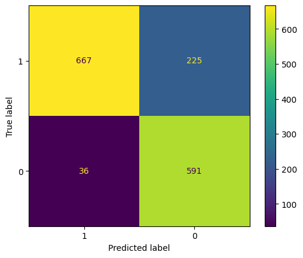
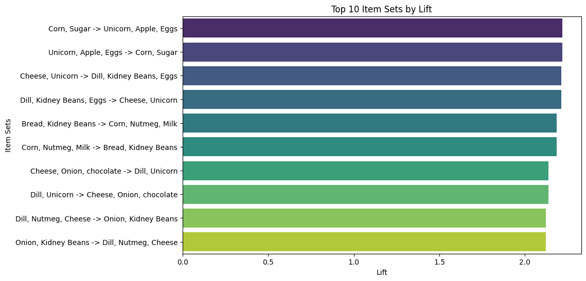
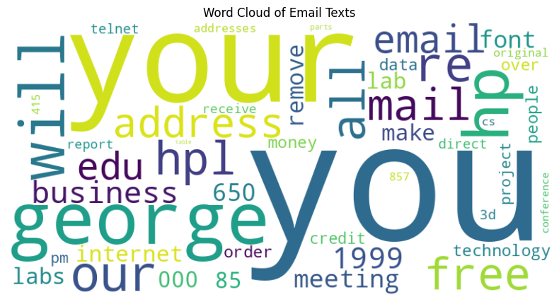

Project Portfolio

# 1. Naive Bayes Classifier for Spam Detection

This project uses the Naive Bayes classifier, a probabilistic machine learning algorithm, for efficient and effective classification tasks. The focus is on building a spam detection model that can handle large datasets and high-dimensional data, applicable across industries for inbox filtering.

Key Steps

	•	Data Preprocessing: Clean and prepare the dataset for analysis.
	•	Feature Extraction: Transform raw data into meaningful features usable by the classifier.
	•	Model Training: Train the Naive Bayes classifier on a labeled dataset.
	•	Model Evaluation: Evaluate performance using accuracy, precision, recall, and F1-score.

### Model Evaluation

### Exploring Better Solutions

While the Naive Bayes classifier achieved an accuracy of 70%, which is a decent baseline, there was potential to improve the results with a more robust model. By implementing a **Random Forest classifier**, the accuracy significantly increased to **92%**, demonstrating its superior performance for this task.

Project Outcomes

This analysis develops a model to detect spam emails, contributing to more effective email filtering solutions.

# 2. Market Basket Analysis

In this project, we conduct market basket analysis to uncover patterns in transaction data. By identifying frequent itemsets and association rules, this analysis provides insights into products frequently bought together, which can drive data-driven strategies in marketing, inventory, and recommendations.

Key Steps

	•	Data Preprocessing: Clean and prepare transaction data.
	•	Frequent Itemsets: Use algorithms like Apriori to identify itemsets that appear together.
	•	Association Rules: Generate rules showing relationships between items.

 ### Project findings

Project Outcomes

The findings provide valuable insights into customer purchasing behavior, aiding businesses in optimizing product offerings and improving customer satisfaction.

# 3. Spam Email Analysis and Word Cloud Visualization

This project analyzes spam emails to identify patterns and visualize common terms using a word cloud. Insights gained from this can help improve spam detection systems.

Key Steps

	•	Data Preprocessing: Clean and prepare the email dataset.
	•	Spam Detection: Build a classification model to separate spam from non-spam emails.
	•	Visualization: Create a word cloud of the most frequent terms in spam emails.

 ### Findings

Project Outcomes

The analysis reveals frequent words and phrases in spam emails, providing a foundation for more advanced spam filtering algorithms.
